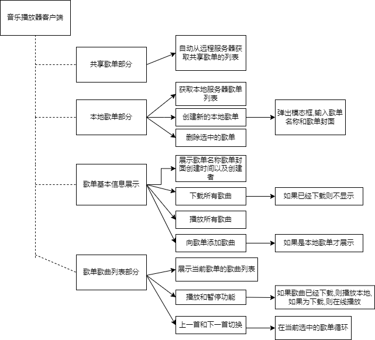
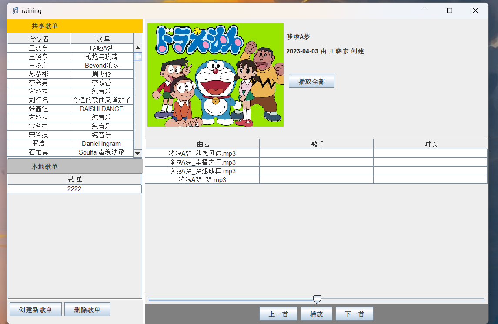
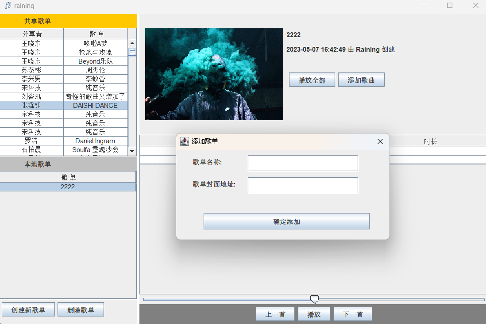
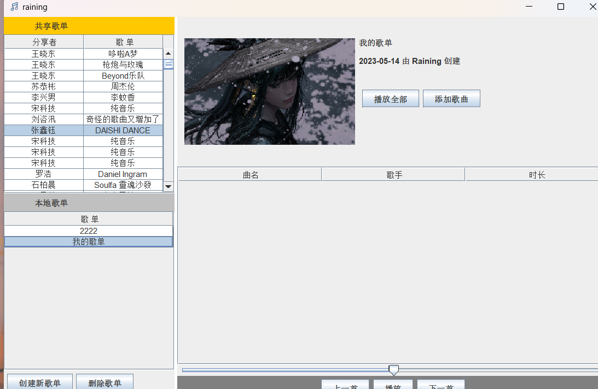
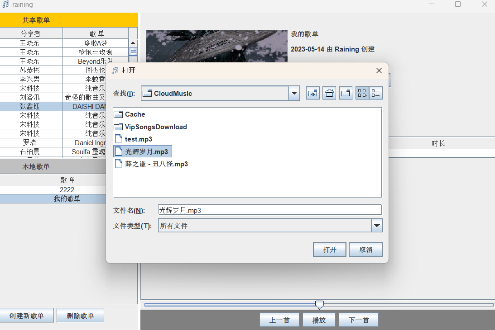
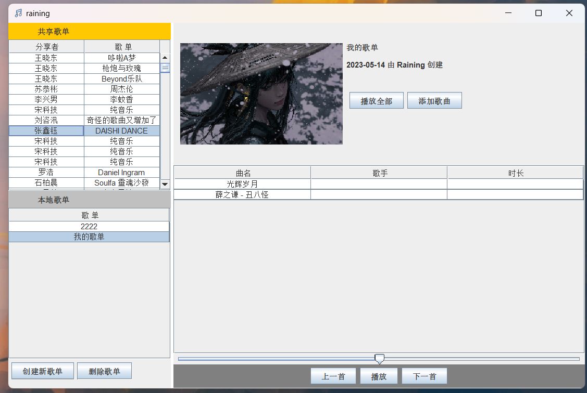
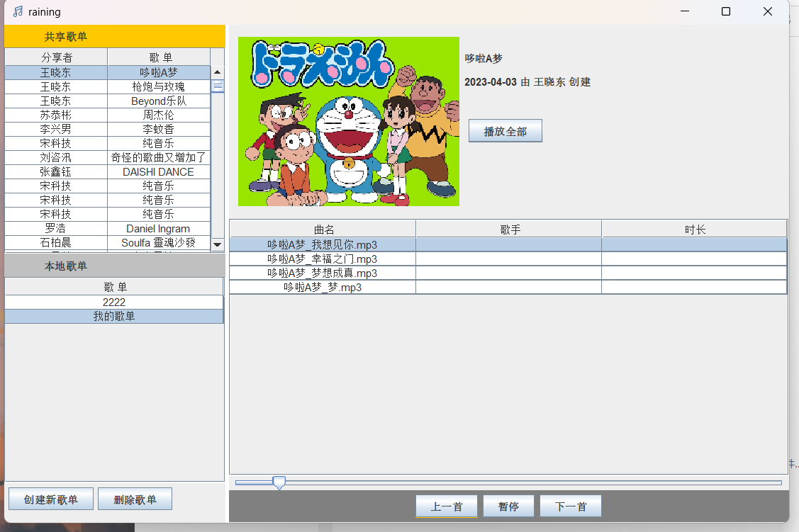

# exp04

2023春信息系统开发(java)中期作业--音乐播放器客户端

## 软件功能说明

1. 该软件为一个简单的音乐播放器,主要功能如下
   - 获取远程服务器的共享歌单并渲染
   - 获取歌单中的音乐列表
   - 下载远程歌单中的音乐
   - 新建本地歌单并存储在本地服务器
   - 向本地服务器增添歌曲
   - 删除本地歌单
   - 获取本地歌单列表
   - 获取本地歌单中的音乐列表
   - 播放远程歌曲或者已经下载的远程歌曲或本地歌曲
   - 暂停歌曲和继续播放
   - 切换歌曲/切换不同歌单的歌曲
2. 软件使用注意事项
   - 因为本地数据库的创建使用了workbench可视化手动创建,所以用户想要使用本地歌单功能需要先创建数据库
   - 新建本地歌单时的封面路径需要手动录入
   - 向本地歌单中添加歌曲时尽量避免添加除了mp3以外的其他格式的文件,避免出现未知错误
   - 共享歌单中的封面和歌曲资源的下载路径为当前工作目录下的covers和songs ,如果因为文件夹不存在而产生了错误,请手动新建这两个文件夹
   - 因为能力和时间原因,仍有部分计划实现的功能没有实现,比如进度条和调节音量等基本的音乐属性的控制

## 流程框图



## 软件模块设计与实现

1. MP3Player.java 播放类

   - 存储播放路径的list和当前播放的歌曲路径位于这个list的索引index,以便确定当前播放的歌曲

   - 其中的play()函数会新开一个线程用来运行 实现了接口Runnable的PlayerRunnable的对象
   - PlayerRunnable中的run函数加载数据流并执行play
   - 以上通过公用一个lock对象来实现多线程的消费生产者模式

2. MusicDao.java和SheetDao.java 操作本地数据库的两个dao包

   - 向歌单/歌曲表中插入新的数据

     传入对应的sheet或者music对象,依次读取对应的参数写入sql语句执行即可

   - 根据id删除歌曲或歌单

     用的delete语句,但这种操作比较危险,一般是通过打一个特殊标识使用update语句实现会比较安全(不会彻底丢失数据)

   - 修改歌单/歌曲

     根据传入的对象的id找到对应表的数据做出修改即可,使用update语句

   - 列出所有歌单/歌单中的歌曲

     列出歌单只需要查找歌单表的所有数据循环列出即可

     列出歌单中的歌曲只需要根据提供的歌单id查询到歌曲表中的对应歌曲循环列出即可

   - 根据歌单id或歌曲id查询歌单或歌曲

   - **根据md5查询歌曲**

     根据需要添加的功能,因为需要播放本地歌单,运行时没有保存歌曲对应的地址,所以需要从数据库中查询对应的歌曲以拿到歌源地址

3. httlclient 包的几个重要类

   - musicSheetTaker 获取远程共享歌单列表
   - FileDownload 文件下载类  可以下载歌单封面和歌曲
   - MusicSheetUploader 将歌单上传到服务器

4. **不同gui组件之间的通信问题**

   > gui和一些ajax请求的类都是使用老师封装好的类,写的最多的还是数据的获取以及渲染到gui中和一些事件的绑定

   - 我将app 也就是MusicPlayerGUI(以下都称作app)作为通信的媒介,以保证其中的子组件可以调用app中的某些变量或方法以达到通信的目的

## 软件运行演示

1. 播放方面: 主要演示了播放本地和在线播放 下载歌曲 以及暂停继续控制下一首上一首的切换
2. 添加歌单
3. 为歌单添加歌曲 以及播放
4. 上述操作都进行了自动刷新的操作

<video src="./assets/演示.webm"></video>

## 项目目录结构

```
├─pom.xml 
├─src
|  ├─main
|  |  ├─java
|  |  |  ├─utils
|  |  |  |   ├─MP3Util.java
|  |  |  |   └SqliteUtil.java					
|  |  |  ├─system
|  |  |  |   └Constant.java
|  |  |  ├─soundmaker
|  |  |  |     ├─DrawPanel.java
|  |  |  |     ├─MP3Player.java							// 音乐播放的核心类
|  |  |  |     ├─NewMP3Player.java
|  |  |  |     ├─PlayerThread.java
|  |  |  |     ├─WaveFileDrawDemo.java
|  |  |  |     ├─WaveFileReader.java
|  |  |  |     └WavePlayer.java
|  |  |  ├─Raining
|  |  |  |    ├─ouc_music_player
|  |  |  |    |        └App.java
|  |  |  ├─player
|  |  |  |   ├─Player.java
|  |  |  |   ├─TestPlayer.java
|  |  |  |   └XMusic.java
|  |  |  ├─musicclient
|  |  |  |      └MusicOperationClient.java
|  |  |  ├─model
|  |  |  |   ├─Music.java
|  |  |  |   └MusicSheet.java
|  |  |  ├─images
|  |  |  |   └music.png
|  |  |  ├─httpclient
|  |  |  |     ├─FileDownloader.java
|  |  |  |     ├─HttpPostWithJSON.java
|  |  |  |     ├─MusicSheetAndFilesUploader.java
|  |  |  |     ├─MusicSheetTaker.java
|  |  |  |     └MusicSheetUploader.java
|  |  |  ├─gui
|  |  |  |  ├─AddSheetGui.java							// 添加本地歌单的模态框gui
|  |  |  |  ├─LocalMusicSheetBlock.java
|  |  |  |  ├─MusicPlayerBlock.java
|  |  |  |  ├─MusicPlayerGUI.java
|  |  |  |  ├─MusicSheetDisplayBlock.java
|  |  |  |  ├─MusicSheetManagementBlock.java
|  |  |  |  ├─MyTable.java								// 二次封装 默认禁止双击编辑
|  |  |  |  ├─NewMusicSheetDisplayBlock.java
|  |  |  |  └SharedMusicSheetBlock.java
|  |  |  ├─db_model
|  |  |  |    ├─Music.java
|  |  |  |    └Sheet.java
|  |  |  ├─dao
|  |  |  |  ├─BaseDao.java
|  |  |  |  ├─MusicDao.java
|  |  |  |  └SheetDao.java
├─songs													// 保存从服务器下载下来的歌曲
├─covers												// 保存下载下来的封面
├─assets
|   ├─1-首页.png
|   ├─2-创建本地歌单.png
|   ├─3-歌单添加成功.png
|   ├─4-向歌单中添加歌曲.png
|   ├─5-添加歌曲成功.png
|   └6-播放.png

```

> 其中songs  和 covers 为远程歌曲的歌曲下载路径和封面下载路径


## 开发期间遇到的问题以及如何解决的

1. 各个gui组件之间的通讯问题:
	基本都用根组件 MusicPlayerGUI做了父子通讯
2. 本地数据库不能创建的问题
	因为我用的是mysql,所以有部分语法不匹配,干脆直接使用了workbench可视化手动创建了数据库和表
3. 播放暂停功能:
	卡了很久,最后还是写的多线程处理的播放暂停,期间也有一些不太合理的地方,都做了修改

### 软件运行截图

主页



添加本地歌单





为本地歌单添加歌曲





播放


